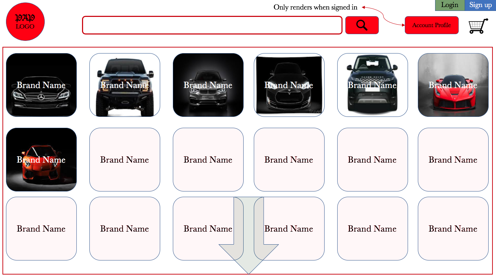
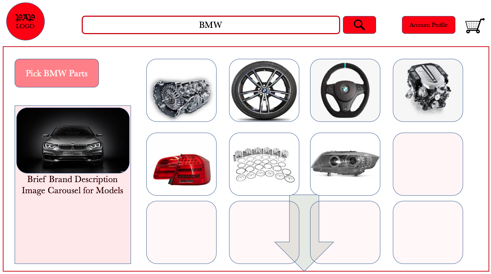
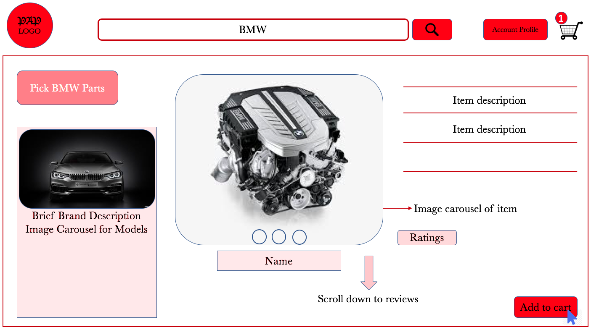
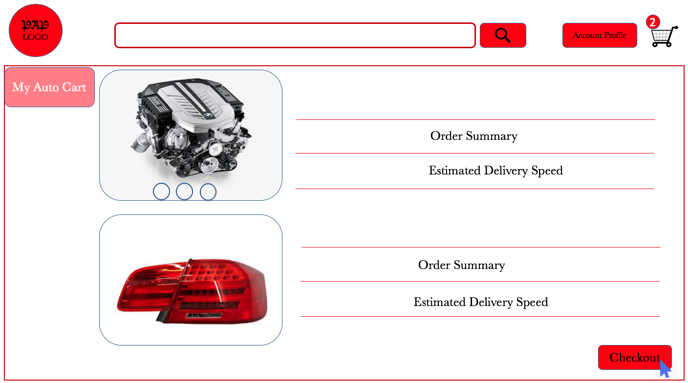
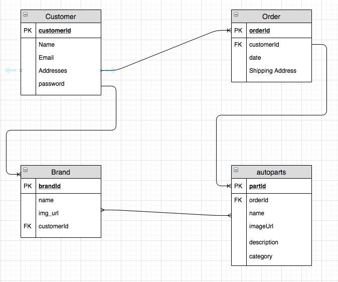

# PickAutoParts --- PAP

Pick-Auto-Parts is an interactive online market place for automobile owners and engineers. The main intent for this application is to create an ease of access for people intending to make purchases for varios kinds of automobile parts. Pick Auto Parts will service people from low to middle and all the way to the high end consumers based on their auto ranges.
Pick-Auto-Parts is a fullstack application that will be implemented with the aim of satisfying visual and functional desires as users will be categorized into two sections i.e.

- Buyers
- Sellers

##### Basic Functionalities

Pick-Auto-Parts will grant users the ability to do the following based on thier categories:

1. As a seller, you will have the functionality of creating your market place where you can add products to already existing categories of vehicles and sub-categories of vehicle types.
2. As a buyer, you will have the functionality of picking parts based on your vehicular choices, add them to your cart and checkout when you want to. Furthermore, you will be able to place comments and rate your experiences on each product you purchase. These comments and ratings will be visible to everyone who visits that product in the future
3. As a random visitor, you will be able to take a look at the gallery of auto parts, search for specific auto parts and share them on your social media plaforms.

### Outlook

This application will have a richly styled layout to help ensure user experience is optimal and smooth.

- The landing page will contain a search bar that will always be visible on all pages for easy search access. The search bar will be embedded as a part of the header section.
- The body section will contain a grid division containing all the auto divisions. These grids will be clickable.
- Another division beneath will contail informations and details about sponsors of the platform.
- All pages will contain an underlaying carousel of newly added products.
- A footer section will contain all other social details.

### Key Features

Pick-Auto-Parts will be implemented using two main web technologies

##### Backend

This will be implemented using Ruby on Rails fro handling several actions such as;

- Create
- Read
- Update
- Delete
- authentication
  These actions will make it possible for the user to make the following request:

###### As a Seller

`Get`
`Post`
`Update`
`Delete`

###### As a Buyer

`Get`

##### Frontend

This will be implemented using REACT and CSS for styling. From the frontend, the application will be able to make several axios calls to connect to the backend and yield results in real time.

#### Wireframes

#### Entity Relational Diagrams

#### MVP

The minimum viable product for this application will be capable of doing the following:

- Authenticate a user and check for existing records to avoid duplications
- Link products to categories to which they belong
- Allow buyers to have the capability to add products to their carts
- Store a complete record of each buyer
